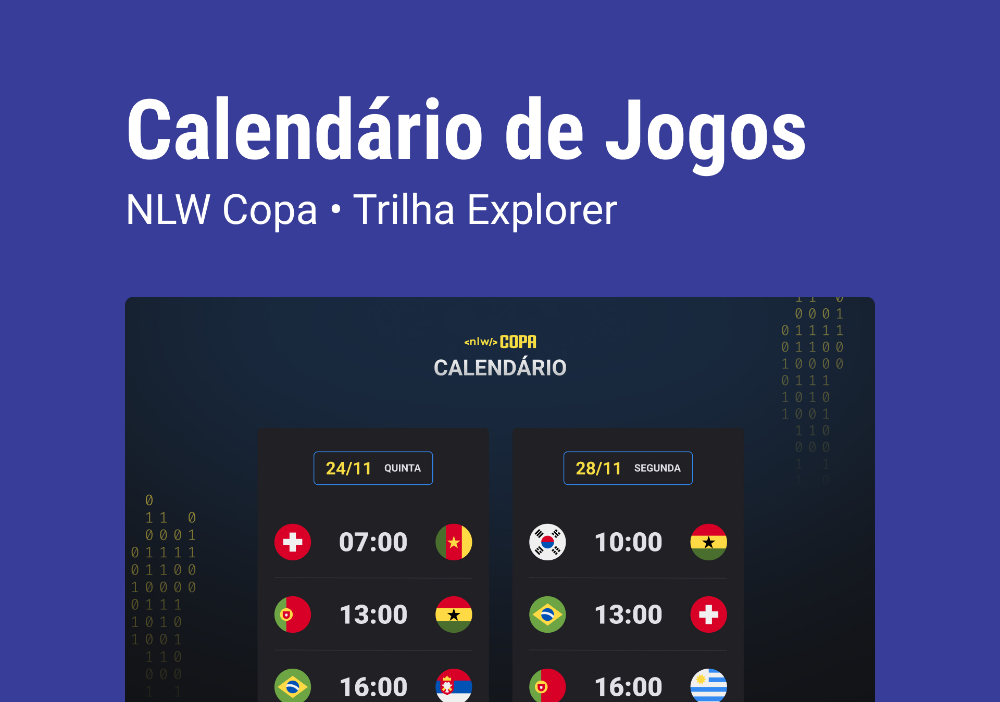

<h1 align="center">NLW #10 Copa - 2022</h1>

Evento exclusivo e gratuito, promovido pela Rocketseat para ensino de tecnologias WEB.

  <a href="#-tecnologias">Tecnologias</a>&nbsp;&nbsp;&nbsp;|&nbsp;&nbsp;&nbsp;
  <a href="#-projeto">Projeto</a>&nbsp;&nbsp;&nbsp;|&nbsp;&nbsp;&nbsp;
  <a href="#-layout">Layout</a>&nbsp;&nbsp;&nbsp;|&nbsp;&nbsp;&nbsp;
  <a href="#-memo-licença">Licença</a>

  

 

  

## :rocket: Tecnologias

Esse projeto foi desenvolvido com as seguintes tecnologias:

- HTML e CSS
- JavaScript
- Git e GitHub

## :computer: Projeto

o Calendário da Copa é um projeto que mostra os jogos da Copa de 2022.

## :bookmark: Layout

Você pode visualizar o layout do projeto atavés [DESSE LINK](<https://www.figma.com/file/8llnPjLuDpNVV4y0MbkK4M/Calendário-de-Jogos-(Community)?node-id=0%3A1>). É nescessário ter conta no [Figma](https://figma.com) para acessá-lo.

---

Projeto feito pela Rocketseat :wave: [Participe da comunidade!](https://discord.gg/rocketseat)
